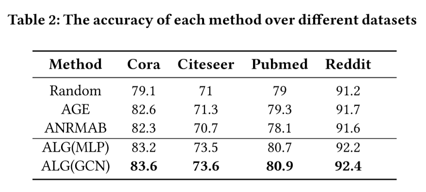
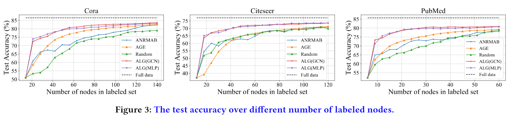
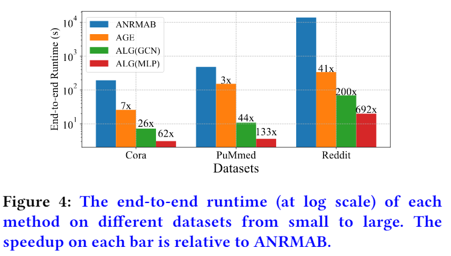
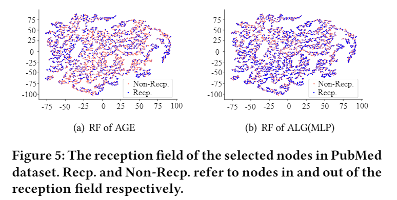

# ALG:Fast and Accurate Active Learning Framework for Graph Convolutional Networks .

This repository is the official implementation of ALG. 


## Requirements

Environment: 16GB(RAM), Ubuntu 16.04 (OS), P100 (GPU), Core i7 (CPU)

To install requirements:

```setup
pip install -r requirements.txt
```


## Training

To train the model(s) in the paper:


> cd the  “example” data

>run the ipynb notebook file "Test.ipynb"


## Results

1.Accuracy comparison:



2. End to end accuracy comparison:



3. Efficiency comparison:



4. Comparison of RF:


